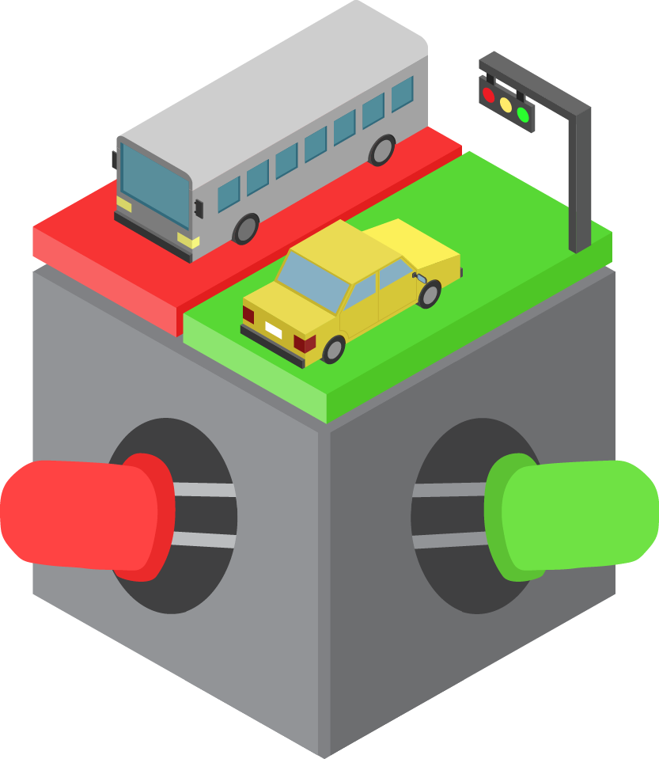
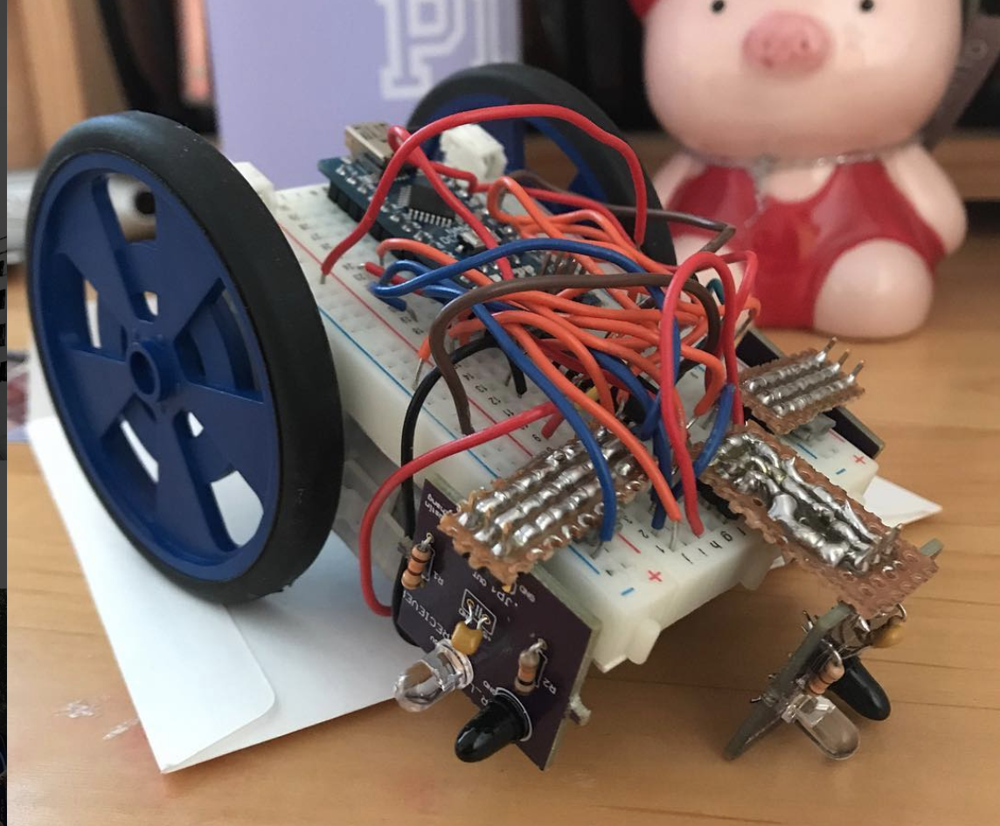

The OPS 2.0 projects have gone through multiple iterations, so shown below are projects that were previously offered as part of the program but were removed due to relevance, difficulty, or other issues. For completeness we still store them here, so feel free to take a look!

## Project 7: [Red Light, Green Light Game](../redlight-greenlight)

|  | Implement a 2-Arduino game called Red Light, Green Light! |

## Project 8: [Radio Red Light Green Light & IMU Brightness Indicator](../radio-redlight-greenlight)

|  | Play Red Light, Green Light wirelessly, use an IMU to detect orientation. |

## Project 9: [Capstone](../capstone)

|  | Use the skills you have learned to make a path-following rodent or an RC car! |
