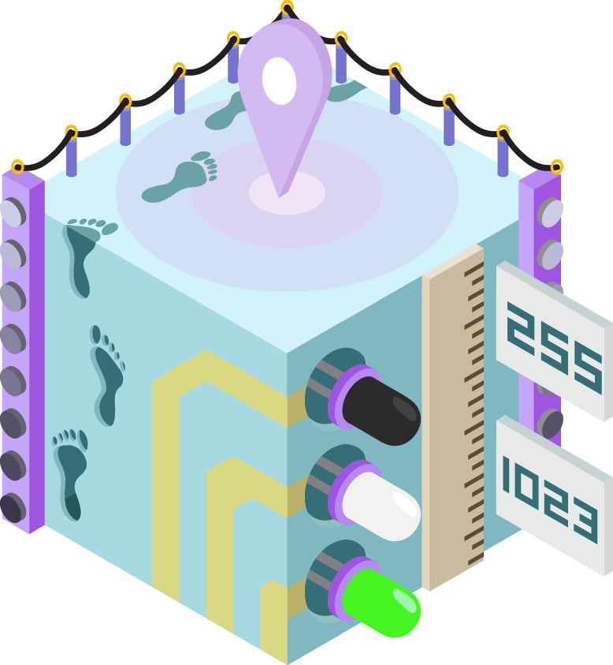
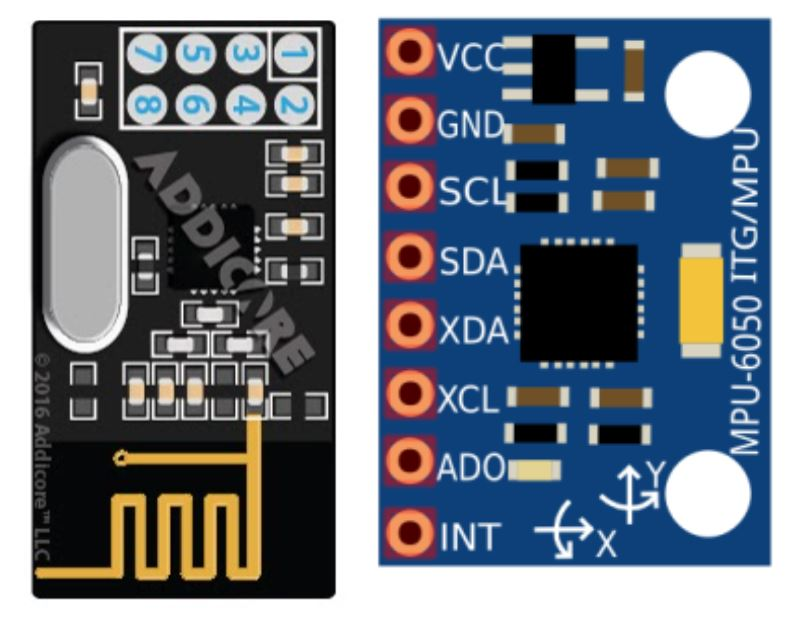

The OPS 2.0 projects have gone through multiple iterations, so shown below are projects that were previously offered as part of the program but were removed due to relevance, difficulty, or other issues. For completeness we still store them here, so feel free to take a look!

## Project 1. [Turning on an LED](../turn-on-led)

|  | Make an LED light up! |

## Project 2. [Debugging](../debugging)

|  | Practice debugging circuits using a multimeter. |

## Project 3. [555 Timer](../555-timer)

|  | Use a 555 timer to blink an LED and play musical notes! |

## Pilot Program

**Projects 4-7** are ideal for an early-stage OPS program.
{: .notice}

### Project 4. [Intro to Arduino: Potentiometer Blink](../potentiometer-blink)

|  | An introduction to Arduino with a fun and easy project. |

### Project 5. [iPoduino: an Arduino Music Player](../ipoduino)

|  | Play your favorite tunes with your very own iPoduino! |

### Project 6. [Arduino Distance Sensor](../distance-sensor)

|  | Learn how to build an Arduino Distance Sensor |

### Project 7: [Red Light, Green Light Game](../redlight-greenlight)

|  | Implement a 2-Arduino game called Red Light, Green Light! |

## Project 8: [Radio Red Light Green Light & IMU Brightness Indicator](../radio-redlight-greenlight)

|  | Play Red Light, Green Light wirelessly, use an IMU to detect orientation. |

## Project 9: [Capstone](../capstone)

|  | Use the skills you have learned to make a path-following rodent or an RC car! |
