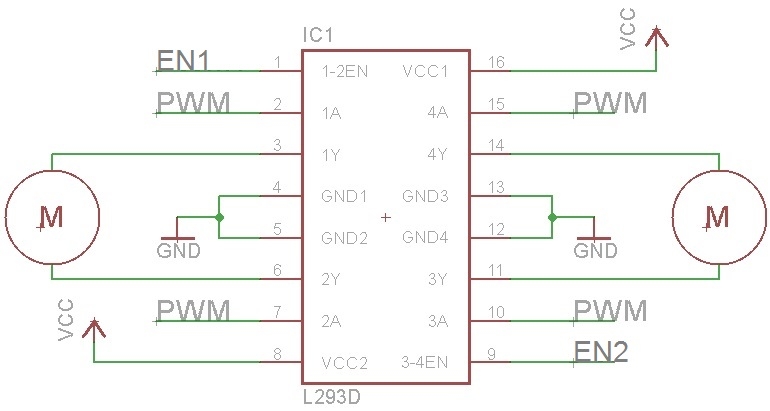

  

## About this Project

This project will be a culmination of all the skills you have learned in OPS. There are two possible tracks you can go down:
1. Rodent (aka. Micromouse capstone): Build a miniature car that stays within the walls of a “maze”
2. RC Car (aka. AP capstone): Control a car by tilting the IMU on your PCB

To do this, you will design your own PCB, and implement a PID controller in software. This project will be more challenging than the previous ones, but the design constraints are more open ended, allowing you to make some design decisions yourself.

### <ins>Prerequisites</ins>
* [Radio Red Light Green Light & IMU Brightness Indicator](../radio-redlight-greenlight)

### <ins>Skills Learned</ins>
* Basic PCB design
* Surface mount device (SMD) soldering
* PID controller

## Parts List

Since this project is open ended, different groups will likely use a variety of parts. Many parts, such as breadboards, IR emitters/receivers, or IMUs, can be reused from previous labs. The new parts you will likely need are:

| Part                                  | Quantity | Estimated Cost | Example Vendor |
| ------------------------------------- | -------- | -------------- | --------------
| Ball Caster | 1 | $2.99 | [Pololu](https://www.pololu.com/product/955) |
| Wheels | 2 | $7.98 | [Pololu](https://www.pololu.com/product/980) |
| Gear Motors | 2 | $12.08 | [Amazon](https://www.amazon.com/gp/product/B01EW8NCGO/ref=ox_sc_act_title_1?smid=A1B3N72XIXC3UJ&psc=1) |

**<ins>Total estimated cost assuming part reuse:</ins>** $23.05 per team of 2  

Additionally, this project requires custom PCBs to be ordered. Here are some potential vendors:
* [JLCPCB](https://jlcpcb.com/)
* [PCBWay](https://www.pcbway.com/)

PCBs are generally not too expensive. In fact, at JLCPCB you can get 5 PCBs for just $2! Depending on how many are ordered, the shipping may cost more than the PCBs themselves.

## Project Specification Part 1 (PCB design)

### [Lecture Slides](https://docs.google.com/presentation/d/1h3jH6_bwaJr0hhUsMQPvK7gjwBcDp_dZqFHCNBrv6i0/edit?usp=sharing)

In this lab, you will be creating printed circuit boards used in your capstone that you have chosen. For the Micromouse capstone, you will be creating a modularized Distance sensor project that you have made from Project 6. For the AP capstone, you will be creating the controller for your remote-controlled car, which will have on it the IMU and the Radio modules you used in Project 8.

### <ins>Downloading EAGLE and Libraries</ins>

* [EAGLE Download](https://www.autodesk.com/products/eagle/free-download)
* [EAGLE Library Downloads](https://drive.google.com/open?id=13Z6iYvRGGS8EH1OHUcO9me-jJM0XMB3G)

First download EAGLE from the link above. Set it up and start it up. Go to the download for the EAGLE libraries that we have provided. You must download both **oshpark.dru** and **osh_park2layer.cam** regardless if you are doing the AP or MM capstone. You can place them in **C:\EAGLE <version #>\dru** and **C:\EAGLE <version #>\cam** respectively, or in the **dru** and **cam** folders of your EAGLE installation folder.

At this point, you will download and follow one of the following videos based on which capstone you are doing.

#### <ins>AP Capstone</ins>

Download the **capstone.lbr**. Ensure you can verify where you downloaded it to later, as you will need to enable the library in EAGLE.

Use [this](https://www.youtube.com/watch?v=Dxezk-m03Jw&index=6&list=PLAWsHzw_h0igdnRfcsX4tTXoVG-bxEEFb) video to create your files.

A few notes:
* **When the video tells you to connect the Power Plane to 5V, ignore that, and connect VCC to 3.3V instead. If you don’t do this, you will fry your radio and IMU.**
* Ensure that your board is no larger than 1.75x1.75 inches, equivalent to 1750x1750 mils.
* Ensure that the smaller capacitor value is closer to the radio (100nF)
* When routing your traces on the board, please favor 45 degree angles over 90 degree angles.

#### <ins>MM Capstone</ins>

Download **IR_Sensor.lbr**. Ensure you can verify where you downloaded it to later, as you will need to enable the library in EAGLE.

Use [this](https://www.youtube.com/watch?v=td88yli_I8E&index=7&list=PLAWsHzw_h0igdnRfcsX4tTXoVG-bxEEFb) video to create your files.

A few notes:
* Ensure that your board is 1x1 inches, equivalent to 1000x1000 mils.
* When routing your traces on the board, please favor 45 degree angles over 90 degree angles.

### <ins>Sending us your Files</ins>

Send your leads the following files:
1. Your .sch file
2. Your .brd file
3. Your zipped gerber files.

### <ins>Troubleshooting/Tips</ins>

When the video says to use the following command, this means to type in the top area box said command. So type ‘net’, ‘move’, ‘add’, etc. Use the **ESC** key to break out of a net, or cancel/break out of your command.

You will need the following EAGLE commands to complete this project:
* add
* net
* move
* name
* label
* erc
* route
* ripup
* rats
* rats @;
* rip @;
* drc
* text

It is extremely helpful to use a mouse while using EAGLE, since right click rotates a component while moving it, and you use the middle mouse button to drag and move across the schematic and board.

Label everything imaginable. You will thank yourself later when you do not have to go back to EAGLE to know what pins correspond to what. This means label on the ‘Schematic’ version and add text to your ‘Board’ layout. The Board layout is what you will be seeing when your PCB arrives. The only places text will show up on your PCB is on Dimensions 21 and 22, which are tPlace and bPlace respectively. **ANY OTHER TEXT THAT IS NOT ON THESE 2 DIMENSION WILL NOT BE PRINTED OUT ON THE BOARD.**

Ensure that the capacitors are near to either the 1x3 header or the Radio module, depending on what capstone you do. Ensure there are no errors when running erc or drc, unless they are errors about naming/silkscreen. Ideally there should be no errors, and let us know if you run into any. You must not have any airwires, or the board is not completed. Using the command ratsnest will let you know if you have any airwires left.

**Do not cross your routes on your board**. This is essentially connecting two of your wires together, which is bad. You can abuse the fact that the bottom plane is disconnected from the top plane, and you can use the middle mouse button to transition from one plane to another.

NOTE: Since vias extend to both planes, you can use them to easily swap between planes. However, they are still separated in a sense that the polygons will not touch even after creating a via. Ensure that your via size is also large enough for your route, which you can specify the size next to the size of your route traces.

## Project Specification Part 2 (Capstone Details)

### [Lecture Slides](https://docs.google.com/presentation/d/1n4hJfv52p-P3TtfBUEjtKd306GumaMZcRkFn3nFRQxQ/edit?usp=sharing)

### <ins>Requirements</ins>

In order to get checked off for this project, you must meet the following criteria:

**Rodent**
* Avoid crashing into walls or straying completely from the line using a control loop
* Design your controller so your path is close to straight
* Turn left or right at a corner and continue straight
* Successfully navigate a path

You must either implement a PI, PD, or full PID controller as long as it behaves according to the requirement. As for the status LED, it is good practice to have some way of observing where your MCU is in its program. For example, you would like to know if it is calibrating sensors or simply stuck in place.

**RC Car**
* Use the radio in conjunction with the IMU to tilt-control the car
* Design your controller so the car can stay still
* Turn left or right at a corner and continue straight
* Successfully navigate a path

### <ins>Capstone Competition</ins>

At the end of the year, we will have a mini-social/competition! This is your chance to show off your accomplishments. The goal is to navigate the path in the lowest time. Winners get bragging rights and a small prize! There will be prizes for 1st, 2nd, and 3rd place teams! Also, winning this competition is something you can brag about to your EE peers.

### <ins>Rodent: Calibrating the Sensors and Measuring Error</ins>

Establishing a base value against which your errors can be calculated is important. Because our sensors are not shielded to ambient interference, we must assume that they are not identical. This leads to the need for two measured error values: left error and right error.

We will use a simple averaging method to find our ideal sensor reading. This consists of initializing a sum variable to zero, adding a user defined number of analogRead samples from the desired sensor, and dividing by this number of samples. This will yield the target value for a sensor measurement. The averaging method should be called twice in the setup function to establish both the left and right sensor targets.

In our actual control loop, we will want to check our position relative to where we should be: the averaged target value. Because our motors will vary in speed due to manufacturing error, drift will occur. In each iteration of the control loop, we need to sample measurements from both sensors (again, take an average of a few values to reduce noise) and find the difference between the target. This will give us error values for both the left and right sides. Because our motors and the errors are coupled, that is, changing one motor affects both errors, it would be unwise to output two separate correction values for the motors. Instead, you can find a total error by taking the difference between the left and right errors. This gives us a fairly good position about which we can correct to zero.

Note: Error propagation is negligible for this project.

### <ins>Motor Driver: L293D H-Bridge</ins>

An H-Bridge is a class of motor driver circuits, and we have an IC version that makes it easy to breadboard.
IN1, IN2, IN3, and IN4 signals control the direction of rotation. To control the speed of the motors, send PWM signals to the EN (enable) pins (in other words, disregard what the image says about PWM).

  

### <ins>Using a 9V Battery</ins>

Relying on the 3.7V Li-Po battery will make your robot move, but it will be extremely sluggish. To give the rodent a boost, you'll need to use the 9V battery to power the motors. **Do not connect the 9V battery to a random pin on the Arduino.** It will die and you will be sad. Connect the 9V only to Vin of the H-Bridge and te Vin of the Arduino (please only connect the battery to the Vin pin when connecting it to the Arduino, do not use any other pin!), and use your Arduino's 5V Output for everything else.

As for speeding up the motors, connect 9V to Vs pin on the H-Bridge motor driver, and connect 5V to the Vss pin. This will allow the driver to power the motors with 9V, and communicate with the Arduino with a standard 3.3V OR 5V logic level.

## FAQ

What orientation do the LED and Phototransistor go in?
* For the LED, on the board, the footprint has a flat side to the circle outline. On the LED, there is also a flat side that matches with the footprint. For the phototransistor, you will have to refer to the datasheet and the schematic for your board. On the datasheet, there is a diagram which shows you what the longer and shorter pins are.

What value resistors should I use for R1 and R2 on the IR sensor board?
* The resistor connected to the IR LED should be 130 Ohms, and the one connected to the IR Phototransistor should be 10 kOhms. Refer to your Eagle schematic and board design to determine which resistor is which. Remember that SMD Resistors have an orientation while SMD capacitors do not.

How do I attach the motors and ball caster to the breadboard?
* The back of the breadboard has an adhesive that the motors and ball caster can be stuck to. You have to remove the paper that is covering the adhesive.
