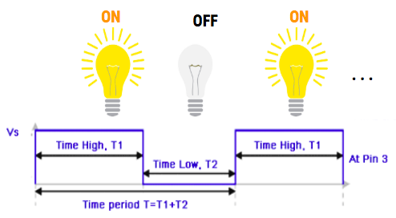
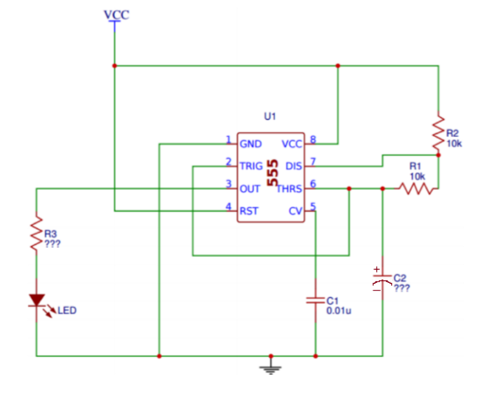
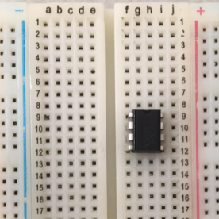
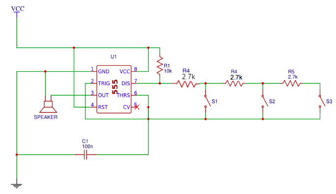

  

## About This Project

### <ins>Part 1</ins>

In this project, you will be making an LED blink using an integrated circuit(IC), more specifically the 555 timer! We will treat the 555 timer as a black box, in the sense that we aren’t too concerned about the internal workings of the timer. We are more interested in what inputs we can use to get the desired output to make your LED blink at the rate you want. You will have to breadboard and solder this circuit for this project.

### <ins>Part 2</ins>

In this project, you will be making a “piano” speaker that can play certain notes by pressing push buttons and using the 555 timer! In this part, you will have to both breadboard and solder onto a perfboard to get checked off.

### [Lecture Slides](https://docs.google.com/presentation/d/1-1Ottsn5AJn0fA2n50ibp06oGncH6MVJiOWw2Bim6eo/edit?usp=sharing)

### <ins>Prerequisites</ins>

* Turning on an LED

### <ins>Skills Learned</ins>

* Breadboarding
* 555 Timer Circuitry
* Soldering

## Parts List

| Part                                  | Quantity | Estimated Cost Each | Example Vendor |
| ------------------------------------- | -------- | -------------- | --------------
| Breadboard | 1 | $1.50 | [Amazon](https://www.amazon.com/DEYUE-breadboard-Set-Prototype-Board/dp/B07LFD4LT6/ref=sr_1_3?dchild=1&keywords=breadboard&qid=1588123957&s=electronics&sr=1-3) |
| Perfboard | 2 | $4.95 (pack of 10) | [Mouser](https://www.mouser.com/ProductDetail/Adafruit/2670?qs=sGAEpiMZZMufdu5QM0tCwbk7gse1KwnzzpqXpp259ss%3D&fbclid=IwAR0XSmT8mlgLUNFXttQ9rNivD7rDtmEtOCPXm3-jsaWjJ3TIhJ5x2jmg0qI) |
| 3.7V Battery | 1 | $7.95 | [Digikey](https://www.digikey.com/en/products/detail/adafruit-industries-llc/1578/5054539) |
| JST Connector | 2 | $0.15 | [Digikey](https://www.digikey.com/product-detail/en/440055-2/A100043-ND/2077946) |
| 555 Timer | 1 | $0.45 | [Mouser](https://www.mouser.com/ProductDetail/?qs=g2rIOKKlpoaFv%2F7nzNfJ5Q%3D%3D) |
| 8 Pin Dip Socket | 2 | $0.18 | [Digikey](https://www.digikey.com/en/products/detail/te-connectivity-amp-connectors/1-2199298-2/5022039?s=N4IgTCBcDaIIwFoxwJwrCgHEkBdAvkA) |
| LED | 1 | $0.25 | [Digikey](https://www.digikey.com/product-detail/en/lite-on-inc/LTL-4233/160-1130-ND/217580) |
| 0.1 uF Capacitor | 2 | $0.24 | [Digikey](https://www.digikey.com/en/products/detail/kemet/C320C104K5R5TA/818040) |
| 68 uF Capacitor | 1 | $1.02 | [Digikey](https://www.digikey.com/en/products/detail/tdk-corporation/FG11X5R0J686MRT06/5811718) |
| 130 Ohm Resistor | 1 | $0.03 | [Digikey](https://www.digikey.com/product-detail/en/stackpole-electronics-inc/CFM12JT130R/S130HCT-ND/2617554) |
| 10 kOhm Resistor | 2 | $0.10 | [Digikey](https://www.digikey.com/en/products/detail/koa-speer-electronics-inc/CFS1-2CT52R103J/13537199) |
| 2.7 kOhm Resistor | 3 | $0.10 | [Digikey](https://www.digikey.com/en/products/detail/koa-speer-electronics-inc/CFS1-4CT52R272J/13537236) |
| Speaker | 1 | $1.01 | [Digikey](https://www.digikey.com/en/products/detail/PSR-29F08S02-JQ/458-1128-ND/2071444?itemSeq=293168811) |
| Tactile Switch (Push Button) | 3 | $0.11 | [Digikey](https://www.digikey.com/en/products/detail/te-connectivity-alcoswitch-switches/1825910-7/1731414) |

**<ins>Total estimated cost:</ins>** $15.17 per member  
*<ins>If reusing Breadboard/3.7V Battery:</ins>* $5.72 per member

## Project Specification Part 1 (Make an LED Blink)

Input:
* Components: R1,R2, or C2
* Background: In order to change the rate that the LED blinks, we can change either R1,R2, or C2. If we want to change the time on given by Ton = 0.69 * C2 * (R1+R2), we can adjust R1, R2, or C2. If we wanted to change the time off given by Toff = 0.69 * C2 * R1, we would change the value of C2 or R1.
* In this project, just use the resistor and capacitor values in the schematic above. You can play with the rate of the LED’s blink on your own time by changing C1,R1, or R2.
Output:
* Pins: Pin 3 and GND
* Output wave: Square wave

  

* The output in this project will go to your LED. The anode (+) leg of the LED will be connected to Pin 3 (OUT) and the cathode (-) of the LED is connected to GND. The output waveform is a square wave in the sense that voltage will either be HIGH (when your LED is on) or LOW (when your LED is off), but not in between and thus your LED will start to blink! This wave will continue infinitely until you remove the power source.

### <ins>Parts Needed</ins>

1. A Breadboard
2. A Perfboard
3. A JST Connector
4. 3.7V Battery
5. 555 Timer
6. 8 Pin dip socket
7. An LED
8. A resistor in series with the LED whose value you calculated from the Turn on LED project
9. Two 10kOhm resistors for R1 and R2
10. A 0.1uF capacitor for C1 connected to Pin 5 (CV = Control Voltage)
11. A 68uF capacitor for C2 connected to Pin 6 and GND
12. Some motivation

### <ins>Schematic</ins>

NOTE: Although it says 0.01uF for C1 in the schematic, use 0.1uF instead

  

### <ins>Part a: Breadboard</ins>
Create the schematic on your breadboard. Make sure you build your circuit before you plug in your battery connected to the JST connector. You should see your LED start to blink if it is working properly!

### <ins>Part b: Soldering</ins>
Solder the circuit onto a perfboard. It will be more difficult than Project 1, so you will have to be very careful. You will also be able to ONLY use ONE WIRE at most for the soldering portion. We recommend you trace out the circuit with a pen/ sharpie onto the perfboard before you actually solder so you know what you are doing. This will give you a lot more practice on soldering and by the end of it, hopefully you will feel more comfortable doing it! Please ask for help if you need it!

One final note:
DO NOT SOLDER THE 555 TIMER!! USE AN 8 PIN DIP SOCKET INSTEAD!!

### <ins>Helpful Tips (READ THIS)</ins>
Place your 555 timer on the bridge between the middle columns of the breadboard. If you placed it so that horizontal pins are on the same row, you will basically short your battery. The top image is what you SHOULD do. The bottom image is what you SHOULD NOT do and since row 9 is connected the battery and ground pins will be connected.

  
  
Do This

  
  
Don't Do This

The intersection of lines may look confusing at first, but if the intersection doesn’t have a red dot, then those two pins aren’t connected. If they do have a red dot, they are connected. For example, Pin 2 and Pin 6 are connected/ share the same node since there is a red dot where their wires on the schematic meet. Another example would be looking at the bottom. You can see how the cathode (-) of the LED, Pin 1(GND), C1, and C2 are connected to ground and essentially “meet” at the same spot or share the same node, which is ground.

The output voltage for the OUT pin will be slightly less than the input voltage from your battery. This means that whatever resistor you used for the previous project will still work for this project. This will be the value for R3.

## Project Specification Part 2 (555 Piano with a Speaker)

This part is very similar to Part 1 where you made an LED blink, but the output is now a speaker and the input is controlled by the push buttons which correspond to a certain resistance between Pin 6 and Pin 7.

Input:
* Pin 7 and Pin 6
* We knew we could change the rate of the LED blinking by changing either R1, R2, or C1. We are going to choose R2 which is the resistance between Pins 6 and 7 to vary from the previous schematic so that we could either increase or decrease the output frequency.
* As you can see when S1 is pressed, current will flow through only the first 2.7kOhm resistor and bypass the other 2.7kOhm resistors since those branches are “open”. Thus, the equivalent resistance between Pin 9 and Pin 7 is 2.7kOhms.
* When S2 is pressed, current will flow through the first two 2.7kohm resistors and bypass the third resistor. Since those two resistors are in series, they will add up to 5.4kOhms.
Output:
* Pins: Pin 3 and Pin 1(GND)
* The speaker will be connected to the output pin or Pin 3 and connected back to ground. When you press on any of the push buttons, it will play a certain note (frequency).
* Remember, a larger resistance for R2 means that the period of the square wave output is larger. A larger period means we have a lower frequency since T= 1/f → f=1/T. Thus the note that the speaker will play will be low. When there is a lower resistance, we have a smaller period and thus a higher frequency.
  * HIGHER RESISTANCE = LOWER FREQUENCY
  * LOWER RESISTANCE = HIGHER FREQUENCY

  

### <ins>Parts Needed</ins>

* A Breadboard
* A Perfboard
* A JST Connector
* 3.7V Battery
* 555 Timer
* 3 Push Buttons
* 8 Pin dip socket
* A Speaker
* (1) 10kOhm resistors for R1 and R2
* (3) 2.7kOhm resistors to use as resistance between Pin 6 and Pin 7
* A 0.1uF capacitor for C1 connected to Pin 5 (CV = Control Voltage)
* Some motivation

You should have all the parts from Part 1 except the pushbuttons and 2.7kOhm resistors. You will also need another 8 pin dip socket since you will be soldering for this part as well.

### <ins>Part A: Breadboard</ins>

First, make sure to break off your speaker wires and resolder them with better wires that you strip yourself! If you don't, you're gonna have a bad time… Use the wire strippers in the lab and if you don’t know how to use it, feel free to ask any officer.

Create the schematic on your breadboard. Make sure you build your circuit before you plug in your battery connected to the JST connector. You should hear your speaker play a note when you press a push button.

### <ins>Part B: Soldering</ins>

Make sure you Solder the circuit onto a perfboard. It will be more difficult than Project 1, so you will have to be very careful. You will also be able to ONLY use ONE WIRE at most for the soldering portion. We recommend you trace out the circuit with a pen/ sharpie onto the perfboard before you actually solder so you know what you are doing. This will give you a lot more practice on soldering and by the end of it, hopefully you will feel more comfortable doing it! Please ask for help if you need it!

### <ins>Helpful Tips</ins>

* If you don't have anything connected between pins 6 and 7, the speaker will not turn on!
* Look at nodes of the schematic and look at the components that are connected to it so that building the circuit on your breadboard is easier

## Checkoff Questions
Here are some questions you can use to test understanding of the concepts involved in this project:

### <ins>Part 1</ins>
1. What happens when you change the value of the 68 uF capacitor? (ie is the capacitance directly or inversely proportional to the blinking rate of the circuit?)
    * The capacitance is inversely proportional to the blinking rate. That means that as you get a higher capacitance, the time it takes to charge increases, blinking less frequently.
2. How do you tell which pins are which on the 555 timer?
    * Find the notch or dot on the IC, which shows you which pin is #1, then the pins are numbered counter-clockwise.
3. What is the purpose of the 0.1 uF capacitor?
    * Removes fluctuations (noise) in the supply voltage

You can use this schematic for reference to make sure they are doing their circuiting right:

  

### <ins>Part 2</ins>

1. Why do you need three resistors for this part of the project?
    * Need 3 to make sure that there are 3 distinct pitches, because the frequency is related to the resistance
2. What happens when all 3 buttons are pressed? This is equivalent to pressing which button?
    * It’s equivalent to pressing only the first button (lowest resistance option). This is because the other two branches will be shorted.

Common Mistakes: If you hear a high pitched sound, 555 timer is broken
