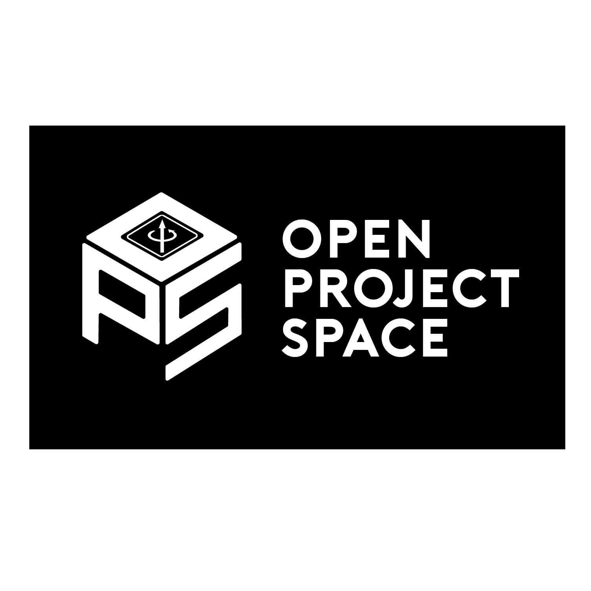

  

In 2010, OPS founder Leo Szeto realized that many Electrical Engineering students at UCLA were dissatisfied with the lack of hands-on projects opportunities offered by the school. Taking matters into his own hands, Leo founded the IEEE at UCLA Open Project Space, a program designed to teach fledgling Electrical Engineering students a suite of essential hardware and software skills through biweekly lectures and fun, hands-on mini projects. Over the past decade, OPS has grown and expanded to include a set of 10 diverse mini-projects and a culminating Capstone project.
OPS remains a cornerstone of IEEE at UCLA, attracting and teaching over 100 new members every year.

  <iframe width="560" height="315" src="https://www.youtube.com/embed/ILv4s27H3WU" frameborder="0" allow="accelerometer; encrypted-media; gyroscope; picture-in-picture" allowfullscreen></iframe>
  <i>The OPS Capstone project, an automatic maze-solving car</i>

## OPS at Your School

Now, we are launching OPS 2.0, a program that aims to bring the hardware engineering projects of IEEE at UCLA to collegiate engineering organizations throughout the world. Just as OPS has been pivotal in growing IEEE at UCLA, we hope that by offering our OPS curriculum and some of our club's best practices, you can find success!

Here is a list of resources that the OPS2.0 program offers:

- A set of tried and true lecture slides and project specs that have been tested and fine-tuned over years of UCLA's OPS program
- A detailed guide to actually running a projects program - from budgeting, to hosting events, to giving lectures and more
- Personal guidance from our team of veteran project leads
- Marketing materials to aid with member recruitment
- Potential funding to help kickstart your program

As of January 2023, we have successfully launched the OPS program at over 10 universities, including UC Irvine, University of Florida, and Stony Brook University. We hope you'll be next!

## How to sign up

If you are interested in bringing OPS to your school's IEEE chapter, please fill out the interest form below. Our team will contact you with details on how to apply.

Questions? Feel free to contact our outreach directors, Eli Foerst and Nathan
Nguyendinh: <outreach@ieeebruins.com>

<iframe src="https://docs.google.com/forms/d/e/1FAIpQLScOSWum3EfZ7Lttogtaa2IrZrO22CP3bneSlE3UrruowJsPwA/viewform?embedded=true" width="640" height="720" frameborder="0" marginheight="0" marginwidth="0">Loading…</iframe>
