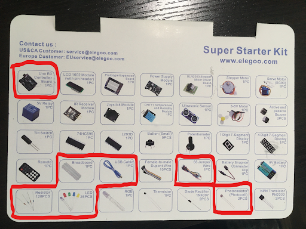

<p align="center">
  
</p>

## About this Project

For this project you will be using the Arduino Uno with a photoresistor to make an LED circuit that turns on or off depending if there is light available. The project will have three checkpoints, please show an officer once you have completed each part, there will be concept questions asked once you have completed the final part.

### [Lecture Slides](https://docs.google.com/presentation/d/1dF1dnGvYLE2jb-1WpLdWECvqcyMBTnF9DnB5DxhW08w/edit?usp=sharing)

### <ins>Prerequisites</ins>

* Building a simple LED circuit
* Understanding of variable resistors

### <ins>Skills Learned</ins>

* Microcontrollers
* Digital/Analog pins
* Basic coding
* Variable resistors

## Parts List

* Microcontroller Board
* Breadboard
* USB Cable
* Jumper Wires
* Resistor (Recall calculated resistance from Project 1)
* LED
* Photoresistor

<p align="center">
  
</p>

## Project Specification
### Pinout

The pinout gives information about the pins available to us when using the Arduino. Please refer to it when programming/wiring. 

<p align="center">
  
</p>

As you can see, each pin is labelled as Digital or Analog, these pins have different capabilities, you should first determine what kind of pin you need to complete the task. Additionally, each pin has an associated label (A0,A1,....,4,5,6,...,13), these labels will be how you refer to pins in the definition portion of your code. 

### <ins>Checkpoint 1: the LED Circuit</ins>

For the first part of this project you will construct a LED circuit. You will recall that you have done this for the first project; however, for that you used the Arduino’s DC supply as if it was a battery. This time you must use one of the Arduino’s programmable pins to provide power to the LED. For this project the LED will only be in two states, thus we can choose any **digital** pin to be the source for our circuit. You must construct your LED circuit with a digital pin, resistor, LED, and finish your circuit by connecting it to ground on your Arduino. 

1. To begin, plug the USB cable into your Arduino and connect it to your PC
2. Connect a jumper wire to the #8 pin on your Arduino, plug the other end into a horizontal row on your breadboard (not + or -).
3. From here connect your resistor and LED pair in series. Connect the end of your circuit to the ground rail (-).
4. Connect your ground rail (-) to the GND pin on your Arduino
Right now your setup should look like this:

<p align="center">
  
</p>

Now we will begin the coding portion of the project:

5. To begin, open up a new sketch in the Arduino IDE. Go to tools->Port and make sure the correct port is selected, if the USB cable is the only thing connected to your PC there should only be one option.

6.  You should see a blank template with `void setup()` and `void loop()`. Above the `setup()` portion type the line `#define LED 8`. This will allow you to reference the #8 pin as ‘LED’ throughout the rest of the code. 

7. Within the `setup()` portion, type the command `pinMode(LED,OUTPUT);`. This notifies the microcontroller that the pin will be used to send out values instead of collecting values. The #8 pin is a **digital pin** so it can only send out two values, HIGH or LOW.

8. Within the `loop()` portion call the function `digitalWrite(LED,HIGH);`. This function tells the LED pin to send out a HIGH voltage. If you type LOW instead the pin will have no voltage and the LED will not be powered.

For this checkpoint you must show an officer a powered LED circuit that utilizes a digital pin to power it.

### <ins>Checkpoint 2: Collecting Brightness Values from a Photoresistor</ins>

For the second part of the project you will use the Arduino to collect “brightness values”. You can leave the LED circuit but you may want to comment out the `digitalWrite` line to turn off your LED while you work on this part.

1. Use a wire to connect the 3.3V source on your Arduino to a positive (+) rail.
2. Use a resistor (I used 330 ohms, but anything in this relative range should work) to connect the positive rail to a horizontal row. Note: this part of the circuit should be independent of the LED circuit, so do not connect it to the same rows as the LED circuit.
3. Grab a new wire, connect one end to the A0 pin in your Arduino. Connect the other end to the same row (node) as the second end of the resistor. This will be the point of your circuit where you take voltage readings from.
4. Next, connect one end of your photoresistor to the same row (node) and the other to a ground rail.
5. To complete your circuit, use a wire to connect the ground rail to the ground on your Arduino. If this ground rail is different from the ground rail you used for your LED you should ‘short’ your grounds by connecting them with a wire.
This is roughly what your circuit should look like:

<p align="center">
  
</p>

(Your LED circuit should still be wired up, it is not included in the picture for simplicity)

6. Now you will begin the coding portion, begin by defining the A0 pin for convenience.
7. Set the A0 pin as an input pin. If you have not already done so, you will also need to begin serial communication in order to use the serial monitor. This can be done with `Serial.begin(9600);`
8. We want to continously print voltage readings on the A0 pin. To do this, use `analogRead(<pin>)`. Recall `analogRead` outputs an integer value between [0, 1023] depending on the voltage it reads between 0-5 votls. You may want to store this value in a variable.
9. Now use `Serial.println(<val>)` to view the values being picked up by the analog pin.
10. Observe how the values change as you change the brightness. 
Try putting the photoresistor really close to a light, try covering it with your finger. Your values will be highly susceptible to change, they will also change depending on the resistor you end up choosing, so don’t expect the same values that your best friend in OPS is getting. You should notice the value increase when there is less light available, and the value decrease when there is more light.

For this checkpoint you must show an officer your photoresistor voltage divider and with the serial monitor displaying values that change based on brightness available.

### <ins>Final Checkpoint: Completing Your Auto-Flashlight</ins>
You're almost there! Combine what you've learned from the previous checkpoints to make the flashlight work properly.
1. You must determine a good transition value for turning your flashlight on/off. To do this you must explore how the value changes based on the surrounding light. Find the point where you’d want the LED to transition between on/off. (Note: there is no one correct value; additionally, there is no correct brightness level it should work with as long as your implementation makes sense and is done correctly).
2. Once you decide the transition value you can save it as a variable as you need. ex)`int val = #`, where # is what you decide.
3. Notice how the analog value increases when brightness decreases, this gives us guidance on how we should set up the conditionals. You can use the following if-else statement to get the behavior you want: 
```
if(x>val)
{
	digitalWrite(LED,HIGH);
}
else
{
	digitalWrite(LED,LOW);
}
```
These conditionals simply say that if our reading is greater than the transition value, the LED should turn on, and if it is less than or equal to the transition value, LED should turn off.

For the final checkpoint you must show an officer your circuit and demonstrate the LED turning on and off with a change in surrounding light. The officer will ask you related questions to test your understanding. 

## Helpful Tips/Common Mistakes

* If you are using two different ground rails, make sure they are connected via a wire so that you have a common ground
* If you are working on this project across multiple days, the light in your environment may change and the transition value you chose before may no longer work.
* If the resistance you choose for the voltage divider is too large, you will not see a noticeable difference in analog readings when the brightness changes.
* Verify your code often, this checks to see if it will compile. The earlier you catch a coding mistake the better.
* Remember the LED is polarized, make sure you place it in the correct orientation.