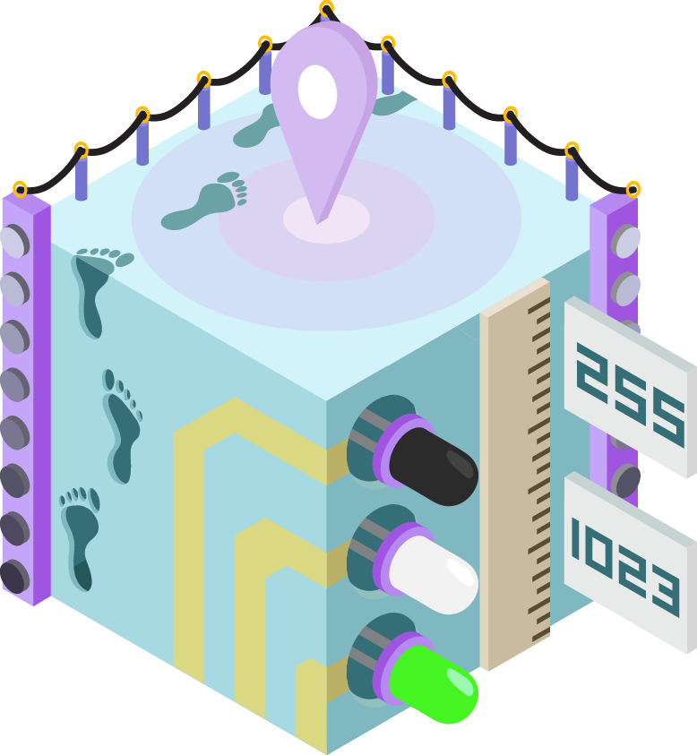
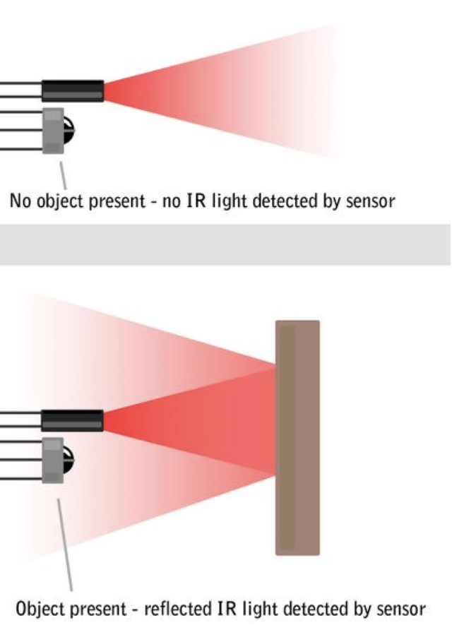
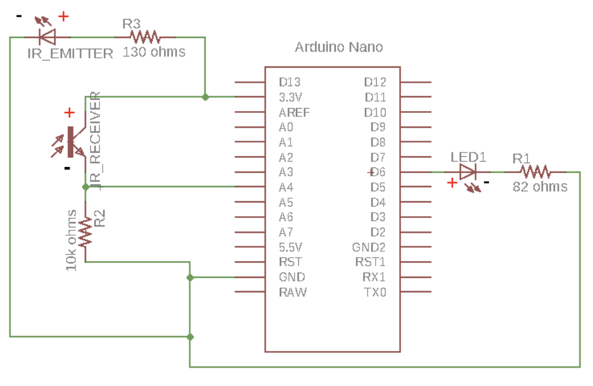

<p align="center">
  
</p>

## About this Project

In this project, you will be making a distance sensor using a phototransistor (IR receiver), IR emitter, and an LED whose brightness will be adjusted based on how long the distance is from an object to the IR receiver and IR emitter pair.

### [Lecture Slides](https://docs.google.com/presentation/d/1VUlLLkaEYgGI9jHbGtPi72Rsy_l05evFw3UaUrRYzW4/edit?usp=sharing)

### <ins>Prerequisites</ins>

* Intro to Arduino

### <ins>Skills Learned</ins>

* Intermediate Arduino programming
* Sensors
* Transistors

## Parts List

| Part                                  | Quantity | Estimated Cost | Example Vendor |
| ------------------------------------- | -------- | -------------- | --------------
| Arduino Nano | 1 | $4.00 | [Amazon](https://www.amazon.com/KOOKYE-Arduino-Nano-ATmega328P-Micro-controller/dp/B019SXNBQY/ref=sr_1_8?s=electronics&ie=UTF8&qid=1468042975&sr=1-8&keywords=arduino%20nano) |
| Mini USB Cable | 1 | $1.80 | [Mouser](https://www.mouser.com/ProductDetail/Qualtek/3021003-03/?qs=sGAEpiMZZMsnDbBzJh6VGJdPZmg6V0p2) |
| Breadboard | 1 | $1.50 | [Amazon](https://www.amazon.com/DEYUE-breadboard-Set-Prototype-Board/dp/B07LFD4LT6/ref=sr_1_3?dchild=1&keywords=breadboard&qid=1588123957&s=electronics&sr=1-3) |
| JST Connector | 1 | $0.15 | [Digikey](https://www.digikey.com/product-detail/en/440055-2/A100043-ND/2077946) |
| LED | 1 | $0.25 | [Digikey](https://www.digikey.com/product-detail/en/lite-on-inc/LTL-4233/160-1130-ND/217580) |
| IR Receivers (Phototransistors) | 1 | $0.27 | [Digikey](https://www.digikey.com/product-detail/en/PT334-6C/1080-1159-ND/2675650?curr=usd&WT.z_cid=ref_octopart_dkc_buynow&site=us) |
| IR Emitters (IR LEDs) | 1 | $0.60 | [Pololu](https://www.mouser.com/ProductDetail/OSRAM-Opto-Semiconductors/SFH-4545/?qs=VcOkZLzzaubOJpq6Xyji1A==) |
| 130 Ohm Resistor (for LEDs) | 2 | $0.03 | [Digikey](https://www.digikey.com/product-detail/en/stackpole-electronics-inc/CFM12JT130R/S130HCT-ND/2617554) |
| 10k Ohm Resistor (for IR Receiver) | 1 | $0.03 | [Digikey](https://www.digikey.com/product-detail/en/yageo/CFR-25JB-52-10K/10KQBK-ND/338) |

**<ins>Total estimated cost:</ins>** $8.66 per member  
*<ins>If reusing Arduino/MiniUSB/Breadboard:</ins>* $1.36 per member

## Project Specification

The basis of this project is the interaction between two interesting and useful electronic components:
1. An Infrared (IR) light emitting LED. Looks like a black LED.
2. An IR phototransistor, or IR receiver. Looks like a clear LED (don't mix them up!)  
We will place these two components next to each other so that when an object is within a close enough proximity,
IR light is reflected from the IR LED into the IR receiver.

This can be seen in the image below:

<p align="center">
  
</p>

By designing our Arduino circuit properly, we'll be able to tell when an object is in front of our
Distance Sensor!

### <ins>Checkpoint 1: Reading IR Values</ins>
<ins>Schematic:</ins>
<p align="center">
  
</p>

Your first task is to build the schematic shown above on your breadboard. In order to power the circuit,
we'll be using a mini USB cable to provide power to our Arduino. Essentially, the IR Receiver
acts as a variable resistor. When no IR light is sensed, it can be thought of as having a very *high* resistance.
When a lot of IR light is sensed, it can be thought of as having a very *low* resistance. Since we are
reading the voltage at the meeting point of the 10k Ohm Resistor and the IR receiver, we have essentially built
a **voltage divider**! If we read the voltage at pin A4 with no object present, it will be near 0V. If we read
it with an object present, it will be near 3.7V. We'll use this to our advantage later.

In order to get best results, make sure your **IR LED** and **IR Receiver** are located as close as possible
to each other. Another thing to be wary of is the polarity of these various components, as they differ from
regular LEDs. A summary is listed below:

| Type | Positive(+) | Negative(-) |
| ---- | ----------- | ----------- |
| LED | Longer Lead<br>Round Edge | Shorter Lead<br>Flat Edge |
| IR Receiver/Phototransistor | Shorter Edge<br>Flat Edge | Longer Lead<br>Round Edge |
| IR Emitter/LED | Shorter Lead<br>Round Edge | Longer Lead<br>Flat Edge |

For the programming portion of this checkpoint, you will need to print out the value read by the IR Receiver to the serial monitor. As the object gets closer, the value that is read should increase.

### <ins>Checkpoint 2: Noise Calibration and LED Output</ins>

By nature of the way we have set up our IR pair, there is **noise**, ambient IR light that is picked up despite no object being present. In order to account for this, we would like to get a new "zero" value by taking the average background value from our IR Receiver over 100 samples.

<ins>An example code snippet is provided below:</ins>

```C++
#define IR 17
long zero = 0;

void setup() {
  // put your setup code here, to run once:
  pinMode(IR, INPUT);
  for (int i = 0; i < 100; i++) {
    zero += analogRead(IR);
  }
  zero /= 100;
}
```

With this in mind, here are the main steps involved in our Arduino program:
1. First we read the raw IR receiver reading using analogRead()
2. Then we need to constrain this value to our new *calibrated* range. Our noise-adjusted "zero" value is our new minimum value. The high value will likely be around 1023, but should be adjusted for best results. The **constrain()** function will come in handy here.
  ```C++
  int new_reading = constrain(x, a, b);
  ```
  This will return:  
  * x *if a < x < b*  
  * a *if x < a*  
  * b *if x > b*    
3. Finally, we will use the new constrained input reading to change our output LED brightness. When an object gets closer, we want the brightness to increase. However, analogWrite() takes a value from 0-255 while analogRead() returns a value from 0-1023. We'll need to use the **map()** function to scale this down!
  ```C++
  mapped_value = map(raw_val, initial_min, initial_max, final_min, final_max);
  ```
  This returns `raw_val` scaled from the initial range to the final range.  

  <ins>Example: Map val from 0-1023 to 0-255</ins>
  ```C++
  void loop()
  {
    int val = analogRead(0);
    val = map(val, 0, 1023, 0, 255);
    analogWrite(9, val);
  }
  ```
### <ins>Final Pseudocode</ins>
```C++
// define the pins

// for calibration
long zero = 0;

void setup() {
  // Set the Serial baud rate
  // Set the pin modes
  // Set the variable zero to the average of 100 samples
}

void loop() {
  // 0 is no IR light, 1023 is max IR light being reflected
  // Step 1: Read IR Reading
  // Step 2: Constrain the raw IR reading from "zero"-1023
  // Step 3: Map the reading to an output value, from "zero"-1023 to 0-255
  // Step 4: Adjust brightness of LED based on new mapped reading
}
```

**<ins>Project Completion</ins>:**  
Show your fully functioning Distance Sensor, where the LED's brightness smoothly scales from zero to full brightness as an object gets closer.

### <ins>Checkpoint 3: Soldering</ins>
In order to solder this project, you will need a perfboard, female headers, and a soldering station in addition to the parts listed in the **Parts List** section.

Notes:
1. Don't solder your Arduino directly to the perfboard! Use female headers instead, allowing us to insert and remove our Arduino.  

## Checkoff Questions
Here are some questions you can use to test understanding of the concepts involved in the Distance Sensor project:

1. What are the three terminals of a transistor called, and which one does the phototransistor
use to take in light?
2. Why should you keep the emitter and receiver close together?
3. What are the parameters to the map function and what does it do with them?
4. Why do we need to sample 100 IR values in setup()?
