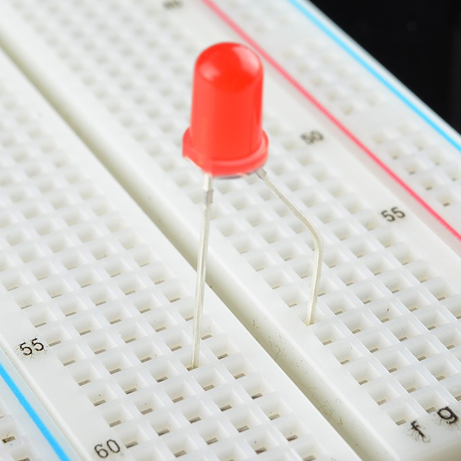
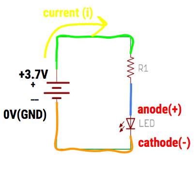
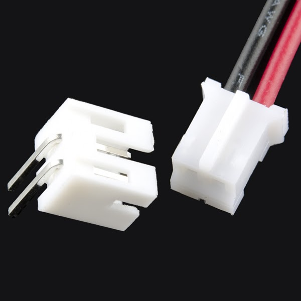
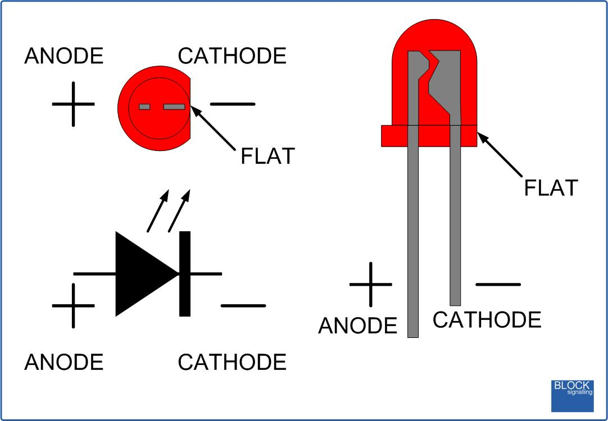

  

## About this Project

In this project, you will be making an LED light up! The first step will be to create the circuit from the schematic on your breadboard. After you have finished this part of the project, bring it to an officer to look at and they'll ask you some questions about it. Then in part 2, you'll solder your circuit to a perfboard. In summary, this project has two parts:
1. Breadboarding an LED circuit
2. Soldering the LED circuit onto a perfboard

### [Lecture Slides](https://docs.google.com/presentation/d/18x92T7hz4mcnHgDH2VxVUuo2SWfroQGlNvljzu12qp8/edit?usp=sharing)

### <ins>Prerequisites</ins>

* None

### <ins>Skills Learned</ins>

* Breadboarding
* Ohm's Law
* Basic LED Circuitry
* Soldering

## Parts List

| Part                                  | Quantity | Estimated Cost | Example Vendor |
| ------------------------------------- | -------- | -------------- | --------------
| Breadboard | 1 | $1.50 | [Amazon](https://www.amazon.com/DEYUE-breadboard-Set-Prototype-Board/dp/B07LFD4LT6/ref=sr_1_3?dchild=1&keywords=breadboard&qid=1588123957&s=electronics&sr=1-3) |
| 3.7V Battery | 1 | $7.95 | [Digikey](https://www.digikey.com/en/products/detail/adafruit-industries-llc/1578/5054539) |
| JST Connector | 1 | $0.15 | [Digikey](https://www.digikey.com/product-detail/en/440055-2/A100043-ND/2077946) |
| LED | 1 | $0.25 | [Digikey](https://www.digikey.com/product-detail/en/lite-on-inc/LTL-4233/160-1130-ND/217580) |
| 130 Ohm Resistor | 1 | $0.03 | [Digikey](https://www.digikey.com/product-detail/en/stackpole-electronics-inc/CFM12JT130R/S130HCT-ND/2617554) |
| Perfboard | 1 | $4.95 | [Mouser](https://www.mouser.com/ProductDetail/Adafruit/2670?qs=sGAEpiMZZMufdu5QM0tCwbk7gse1KwnzzpqXpp259ss%3D&fbclid=IwAR0XSmT8mlgLUNFXttQ9rNivD7rDtmEtOCPXm3-jsaWjJ3TIhJ5x2jmg0qI) |

**<ins>Total estimated cost:</ins>** $14.83 per member  
*<ins>If reusing Breadboard/3.7V Battery:</ins>* $5.38 per member

## Project Specification Part 1 (Breadboarding)

You will need the following materials for this part of the project.

1. Breadboard
2. 3.7V Battery
3. JST Connector
4. LED
5. Resistor (calculate this)

You will need to calculate the resistor value on your own (hint: look at the slides).

### <ins>Schematic</ins>

Please follow this schematic below to make your circuit. Remember the orientation of how you put in the LED in your breadboard and the two ways you can tell what the anode (+) and cathode(-) is on the LED.

  

### <ins>Helpful Tips</ins>

* To connect your battery to the breadboard, you will need something called a JST connector pictured below. The ridge at the end of the battery wires should fit into the JST pretty easily

  

* Set up the circuit before you put the battery in
* The red wire of the battery represents the 3.7 V power, while the black wire represents the 0 V battery
* If you're not sure about your circuit, show us before you put the battery in!
* Don’t short your battery by connecting it with a wire
* Don’t connect the same component’s two leads on the same row of the breadboard

### <ins>DataSheets for LED</ins>

Remember, on the data sheet you are looking for the forward current/voltage needed to turn on the LED. You will have to filter through some specifications, but it should specifically say “Forward Current” and “Forward Voltage”. The column that says “Typ” means that this is the typical value for the component. Please use this value.
* [LED Datasheet](https://media.digikey.com/pdf/Data%20Sheets/Lite-On%20PDFs/LTL-4233.pdf)

These values are what you will need to calculate the resistor value of the resistor you will need to pair with your LED.

## Project Specification Part 2 (Soldering)

In part 2, you will basically “solder” an LED circuit onto a perfboard. You did all the prototyping on the breadboard to make sure your circuit was working. Now, you can permanently put it onto a perfboard. You will also be using the same exact components (resistor, LED, battery, etc.) that you used in part 1(breadboarding) for this part.

### <ins>Basic Summary</ins>

Soldering is the process of joining two or more electronic parts together by melting solder around the connection. Solder is a metal alloy and when it cools it creates a strong electrical bond between the parts.

Here is a full tutorial on how to solder a circuit (LOOK AT THIS): [Beginner's Guide to Soldering](https://docs.google.com/document/d/1qTqpOPxwoDCLLWKU5P1Y9KdD15X9sSmfSCZOUh2mrgA/edit?usp=sharing)

Make sure you ask an officer before you actually physically solder your circuit onto the perfboard!

### <ins>Helpful Tips</ins>

* Try not to use all the space on your perfboard, by keeping your circuit in a compact corner. You don’t want to do more work and solder the entire area of the board.
* The soldering iron is very hot, so don’t touch the tip of the iron with your bare hands…
* Remember to turn off the iron when you are done
* Don’t leave a mess at the ironing station

**<ins>Project Completion</ins>:**  
Show your fully soldered LED circuit.

## Checkoff Questions
Here are some questions you can use to test understanding of the concepts involved in part 1 of this project before moving on to part 2:

  

<ol>
  <li>How do you determine the polarity (+ side vs. - side) of an LED?
    <ol>
    <li>Leg length
      <ol>
      <li>Anode (+): Longer Leg</li>
      <li>Cathode (-): Shorter Leg</li>
      </ol>
    </li>
    <li>Bulb Shape
      <ol>
      <li>Anode (+): Round</li>
      <li>Cathode (-): Short</li>
      </ol>
    </li>
    <li>Interior Metal Piece
      <ol>
      <li>Anode(+): Thin</li>
      <li>Cathode (-): Fat</li>
      <li>Didn’t go over this one in lecture, so just tell them this if they didn’t know</li>
      </ol>
    </li>
    </ol>
  </li>
    <li>Which side of the LED connects to the + terminal of the battery?
      <ol>
        <li>LED Anode (+)</li>
      </ol>
    </li>
  <li>Why do we need a resistor in our circuit? What would happen if we didn’t?
    <ol>
      <li>We need it to keep the current under the LED’s maximum current rating</li>
      <li>We risk burning out the LED, or creating a short circuit</li>
    </ol>
  </li>
  <li>How do we pick a Resistor for the circuit?
    <ol>
      <li>Subtract LED operating voltage from Battery voltage</li>
      <li>Divide by LED max current rating to get min resistance value</li>
      <li>Note: There are multiple ways to do this. As long as KVL and Ohm’s Law are used, it’s ok!</li>
    </ol>
  </li>
  <li>Walk me through how you plan on soldering
    <ol>
      <li>Have a plan! Draw out a schematic</li>
      <li>Turn on soldering station (650 F)</li>
      <li>Wait for soldering station light to start blinking</li>
      <li>Turn on exhaust</li>
      <li>Use clamps/helping hands</li>
      <li>Unplug batteries!</li>
      <li>After: clean up, turn off fan and soldering station, wash hands!</li>
    </ol>
  </li>
</ol>
